# **_Afro Urban Hub - Project Portfolio 1 - HTML & CSS_**

# Table of Contents
* [Introduction](<#introduction>)
* [User Experience (UX)](<#user-experience>)
  * [Target Audience](<#target-audience>)
  * [User Stories](<#user-stories>)
  * [Site Aims](<#site-aims>)
* [Design](<#design>)
  * [Design Wireframes](<#design-wireframes>)
  * [Site Structure](<#site-structure>)
  * [Colour Scheme](<#colour-scheme>)
  * [Typography](<#typography>)
  * [Imagery Used](<#imagery-used>)
* [Features](<#features>)
  * [Present Features](<#present-features>)
    * [General](<#general>)
    * [Navigation](<#navigation>)
    * [Home Page](<#home-page>)
    * [About Us Page](<#about-us-page>)
    * [Get Involved Page](<#get-involved-page>)
    * [Contact Us Page](<#contact-us-page>)
    * [Footer](<#footer>)
  * [Future features](<#future-features>)
    * [Login](<#login>)
    * [Blog Post](<#blog-post>)
    * [Document Repository](document-repository)
    * [Events Calender](<#events-calender>)
    * [Signup for Newsletters](<#signup-for-newsletter>)
    * [Projects Gallery](<#project-gallery>)
    * [Images and Videos Gallery](<#projects-and-videos-gallery>)
    * [Donation](<#donation>)
    * [Expanded Footer](<#expanded-footer>)
* [Deployment and Local Deployment](<#deployment-and-local-deployment>)
    * [Deployment](<#deployment>)
    * [Local Deployment](<#local-deployment>)
      * [How to Fork](<#how-to-fork>)
      * [How to Clone](<#how-to-clone>)
* [Testing](<#testing>)
  * [Automated Testing ](<#automated-testing>) 
    * [HTML Validation](<#html-validation>)
    * [CSS Validation](<#css-validation>)
    * [Lighthouse testing](<#lighthouse-testing>)
  * [Responsive Testing](<#responsive-testing>)
  * [Accessibility Testing](<#accessibility-testing>)
  * [Manual Testing](<#manual-testing>)
* [Bugs](<#bugs>)
  * [Bugs Fixed](<#bugs-fixed>)
  * [Bugs not Fixed](<#bugs-not-fixed>)
* [Technologies Used](<#technologies-used>)
* [Credits](<#credits>)
* [Acknowledgments](<#acknowledgments>)

## Introduction
Welcome to the website of Afro Urban Hub (AUH), a non-profite organisation that provide technical and advisors services to city administations. Our mission is to makke African cities more inclusive, livabele, funtional and prosperious. Additionally, our organisation focuses on building a community of practice of professional commited to improving urban neighbourhood and communities. This site offers information about the organisation and provieds an opportunitiy for interested individaulas to sign up and become members of our community of practice.

The website is now live and available for viewing here - <a href="https://samuel-senesie.github.io/portfolio1-afro-urban-hub/" target="_blank">Afro Urban Hub</a>

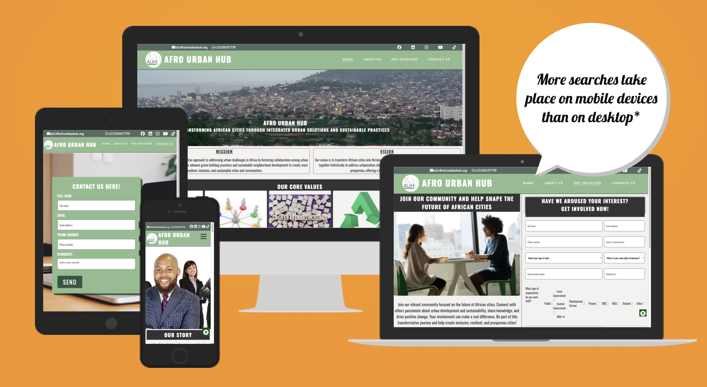

## User EXperience (UX)

   ### Target Audience

* Individuals interested in transforming African cities through integrated urban solutions and sustainable practices.
* Users looking to join a community of practice and collaboration to develop sustainable solutions for urban challanges. 
* People seeking to learn about AUH's initiatives and its partners.

### User Stories
* Users should  easily access information about AUH, its initiatives, and the community of practice, including how to become a member. 
* Users should be able to find the contact information and use a secure method to send messages to the organization. 
* Prospective members should be able to apply to joinn the community of practice seamlessly. 
* Visually impared users should navigate and read contents with ease. 
* All users should be able to find the menu and page contents easy to navigate. 

### Site Aims
This site aims to achieve, among other things the following:
* Provide comprehensive information about AUH's initiatives and activities.
* Offer contact details for the organisation and direct visitors to its social media profiles.
* Facilitate the process for users to join the community of practice. 

[Back to top](<#table-of-contents>)

## Design

  ### Design Wireframes
  The wbiste was initially envisioned aith a simple design and structure, which was created using Balsamiq software was used to develop a visual wireframes. These wireframes were designed for desktops, laptops and mobile phones. Please note that there may be some deviations between the final design and the initial wireframes due to adjustment made during the websit's development.

  Below are images of the wireframes that were developed. 

  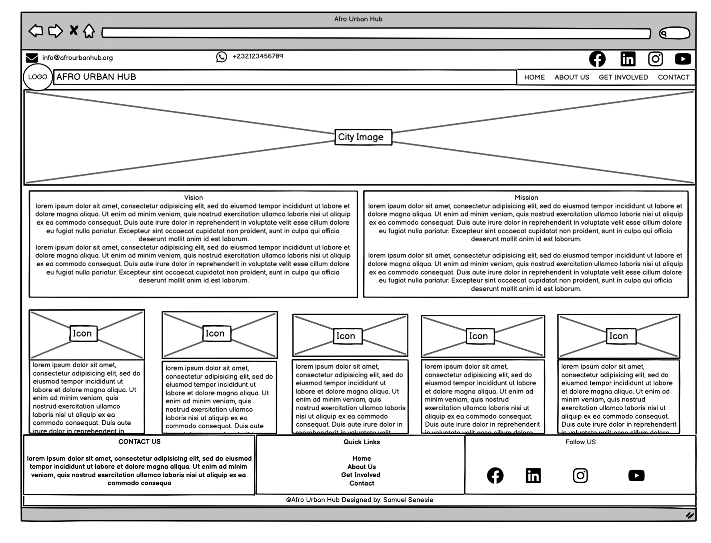

  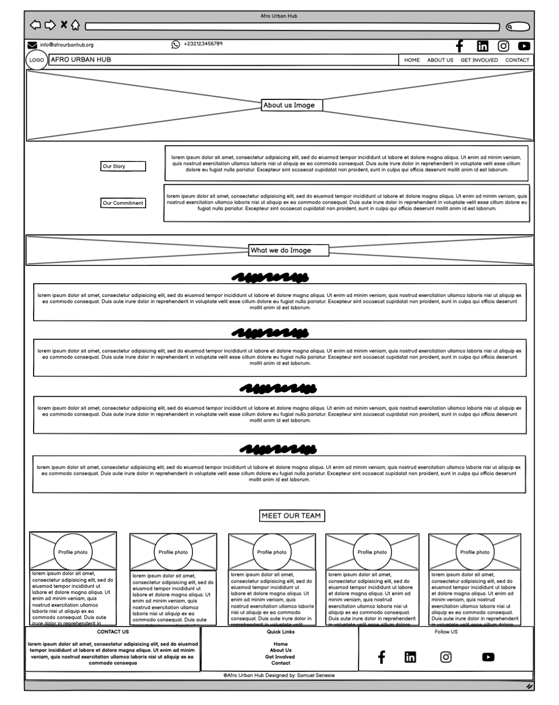

  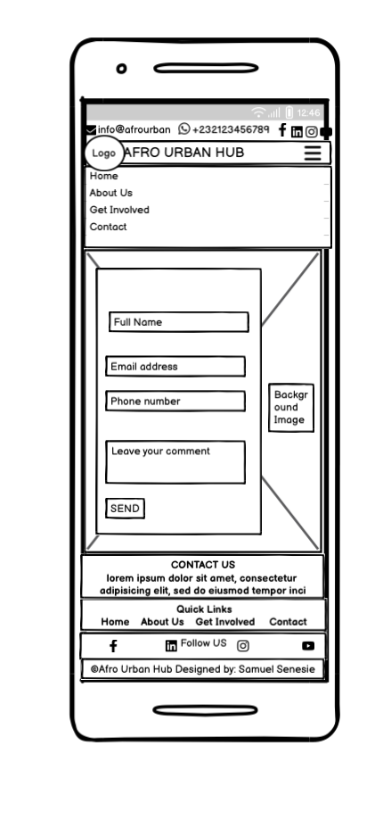

### Site Structure
The AUH website consists of four pages: [Home](index.html), [About Us](about-us.html), [Get Involved](ger-involved.html) and [Contact](contact.html) pages. Users can navigate these pages via the menu bar  diplayed in the top right-hand corner of the second nav bar on tablets, laptops and desktops. 

Each page on the website consists of three nain sections: a double navigation bar at the top, the main content area,  and a double footer at the bottom. 

### Colour Scheme
For the website's colour scheme, a combination of Darksegreen and 'rgba(8, 43, 29, 07)' was chosen, paired with white(#fff) text and fonts for the navbar and footer. The footer headings use black text to creat a distinct contrast with the rest of the footer content.

The darkseagreen colour and white texts were chosen to align with the logo's colours and to symbolize sustainability. 

For the main content, '#f3f2f1' was selected as the background colour for text areas and #333333 was used for the background of divs that hold icons and images.

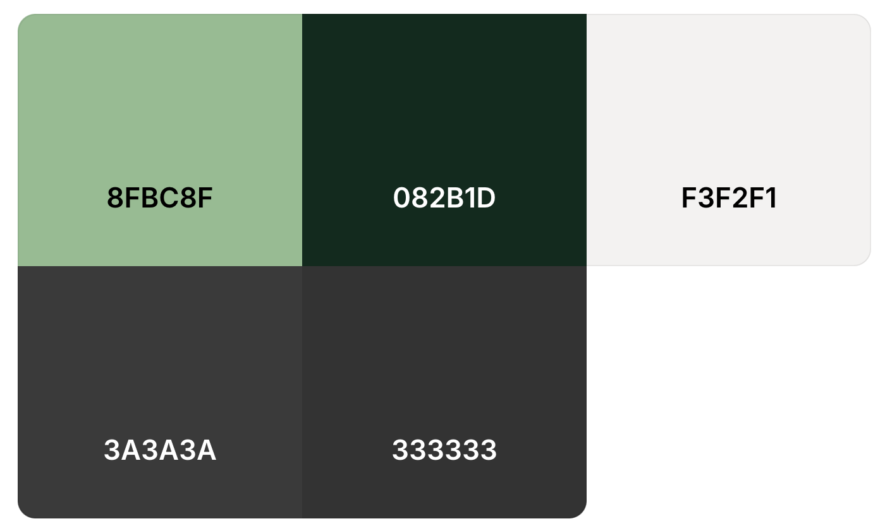

### Typography
For this website, Oswald font was selected because of its distinctive elongated characzers, which enhances visibility and make text stand out on the page. 

### Imagery Used
The logo featured on this website is a propoerty of Afro Urban Hub. The city photo used on the Home page is credited to the developer of this website. All other images on this site are sourced from third parties and have been properly credited in the citation section of ths document. 

[Back to top](<#table-of-contents>)

## Present Features

### General

The AUH website consists of four pages: [Home](index.html), [About Us](about-us.html), [Get Involved](ger-involved.html) and [Contact](contact.html) pages. Users can navigate these pages via the menu bar  diplayed in the top right-hand corner of the second nav bar on tablets, laptops and desktops. 

Each page on the website consists of three nain sections: a double navigation bar at the top, the main content area,  and a double footer at the bottom. 

At the bottom of the scree, there is a "back-to-top" button with a white icon on a green background. This button allows users to quickly return to the top of the page, making it easier to navigate without long scrolling

While the contents and layout of the navbar and footer are consistent for all pages, the contents and layout of main sections of each page differ significantly in both content and design.

[Back to top](<#table-of-contents>)

### Navigation

Each webpage feautures a bouble navigation bar: a top bar and a second navbar. The top right-hand corner of the the topbar includes icons and links to our Facebook, Linkedin, Instagram, Youtube and TikTok sosial meida handles. The top left-hand corner displays clickable links to the contact email-address and the whtasapp number. 

When clicked, the social media icons will opens each platform's homepage in a new window. The email address link launches a new email window, while the Whatsapp link directs users to the organizations page. Please note that the email address and whatsapp number are only provided as examples.

The left hand-side of the second navbar holds the logo and at the right-hand side is the menu (feauturing the Home, About Us, Get Involved, and Contact pages). On smartphones the menu can be accessed by tapoing the hambuger icon on the top right-hand corner of the second navbar which displays a dropdown menu. On larger screens, the active page is highlighted with an underline beneath its name on the menu bar.

By default, clicking the logo users are directed to the index page which loads the home/landing page.

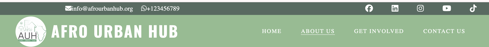

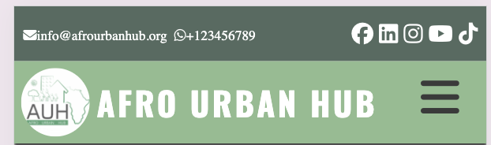

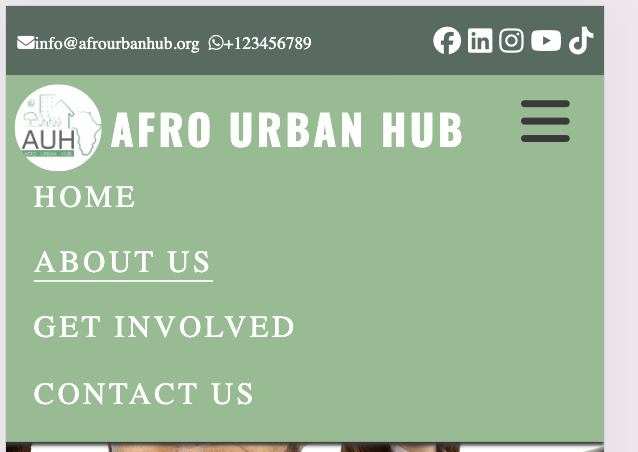

[Back to top](<#table-of-contents>)

### Home Page

The Home page serves as the landing page of the website and is the first point of interaction for users. It provides an overview of the organization, including its core values, vision and mission statments.

The main section of the Home page is divided into three main sections:

* The top section features an image of a city accompanied by a cover text with a catch phrase that that highlights the works of the organsation.

* The middle section displays the Mission and Vision statements, each housed in its own div box.

* The bottom section of the Home page presents the five core values of the organisation, each represented by an icon followed by descriptive text to engage users.

All sections of the page are fully responsive for different screen sizes. On smartphones and tablets, the main content is displayed in vertical stack, with each section dispalyed one after the other. On larger screens (laptop and desktops), the Vision and Mission statment are presented side by side, while all five core value divs are aligned in a single row.

[Back to top](<#table-of-contents>)

### About Us Page

This page offers an overview of the organization's work, it's core services and its team, presented across distinct sections.

* At the top is an image of a group of four people representing the orgaisation.

* Below the image are two sub-sections with paragraphs the story and commitment of the organisation. 

* This is followed by the "What we do", highlighting the five main services of the organisation.

* The final section showcases the images and short bios of the key staff members. Please note that the images, names bios feautured here are only used as examples. 

[Back to top](<#table-of-contents>)

### Get Involved Page
This page is designed to invite and persuade users to join the community of practice. It provides coincise information on the purpose of the community, a sign-up form for interested individuals, and hihlights some of the benefits of becoming a member.

* At the top of the main section, an image of two women seated across a table is displayed, followed by a text explaining the purpose of community of practice. This represents a member inviting users to join 

* Next is the "Get Involved" form, a simple and userfriendly questionnaire. Users are required to provide their full names, email address, phone number, organization name and type, and agree to the terms and conditions before submitting the form by cliking the blue "Get Involved" button at the bottom. The other information on the form are optional. All user information provided are sent to https://formdump.codeinstitute.net. The form is cleared after submission by reloading the page.

* The final section highlights the key benefits of joining the community of priactice, with each benefit represented by an image and descriptive text to engage users.

The page is fully responsive across all devices -  smartphones, tablets, laptops and desktops. On smartphones, sections are displayed in vertical stack. On tablets, the first two sections are stacked vertically, with the last section presented in a grid of two rows and two columns.

Images of the page are shown below: 

[Back to top](<#table-of-contents>)

### Contact Us Page

The main content of this page includes a contact form set against a background image  featuring a laptop, smartphone and a coffee cup on a tabel.

The contact form requires users to enter their full names, email address, phone number and comments before submitting the form by tapping or clicking on the darkgreen "SEND" buttton. All information submitted is posted to https://formdump.codeinstitute.net.

This page is responsive accross all devices. 

### Footer

The website includes a double-layer footer, with the bottom section displaying copywrite information and name of the website designer. The main footer is divided into three section: Contact Us, Quick Links, and Follow Us.

* The "Contact Us" section provides the physical address, email and phone number of the orgainsation.

* The "Quick Links" section offers clickable links to the other pages of the website. On larger screens, the active page is highlighted with a double underline beneath its name. When cliked, the links open the corresponding pages in a new tab. 

* The "Follow Us" features white social media icons that supposed to anchor the organisations links to the social media media profile. When hovered over, the colour of the social media icons changes from white to aqua and revert to white when clicked. Clicking these icons opens the socail media homeepage in a new tab. Please note that only Facebook will open the organisation's profile, the rest will take users the homepage of the various social media platforms.

On smartphones and tablets, the main footer are displayed in a vertical stack starting with "Contact Us" section at the top, with the bottom bar at the end. The content of is arraigned horizontally acrosss the screen. 

On laptops and desktops, the three sections of the main footer are displayed in a single row, starting with the "Contact Us" on the left and the "Follow Us" section on the right, above the bottom bar. 

The footer is responsive across all devices.

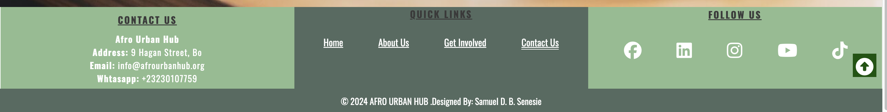

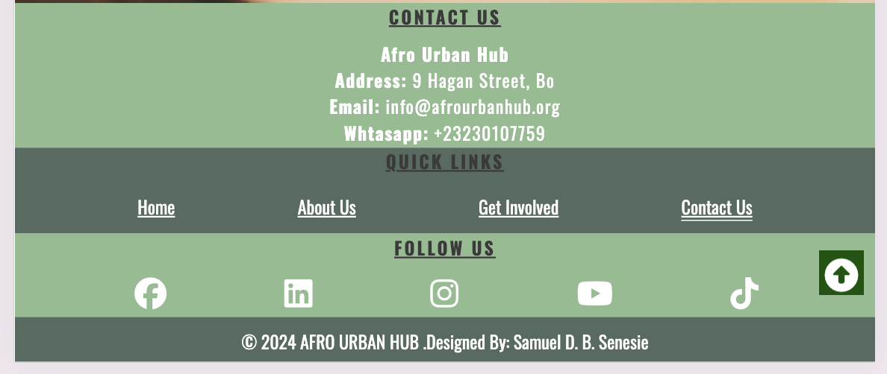

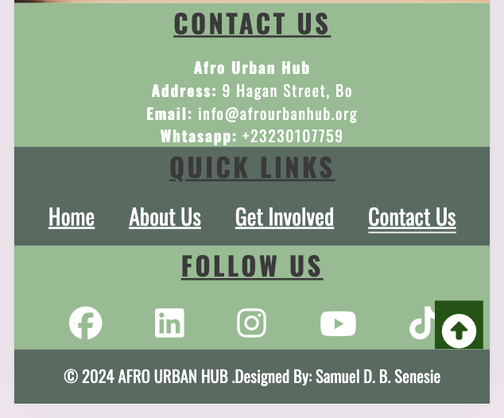

[Back to top](<#table-of-contents>)

## Future features

The folloing is a non-exhustive list of feautures to be considerd for future development:

### Login

A login option on the menu bar or "Get Involved" page could enable useres to post and contribute to blog posts, access documents and lerning materials from a central repository, showcase thier works and products, access and view events calaender.

### Blog Post

This feature would allow administrators and approved usesr to publish and moderate blog posts according to established community giudeline.

### Document Repository

This centralized document repoitora could be created to share published materials from partners and members, including researsch papers, project reports and other open-source documents and tools The repository could be organized by thematic areas for improved user experience.

### Events Calender

This section would allow users to be informed about upcoming enints, sign up for them, and receive reminders and notifications.

### Signup for Newsletters

This section would allow user to subscribe to newsletters.

### Projects Gallery

The project section to display projects, with links to related doccuments, project details and images.

### Images and Videos Gallery

An image gallery could be added to display photos and videos of projects, products, and events. The gallery could be organized by date, type or events for better user experience.

### Donation

As a non-profit organisation, AUH relys on donations from the public and other institutions. A donation button linked to secure payment gateway, icluding mobile money payment options would be beneficial.

### Expanded Footer

The footer section could be enhanced to display the logos and names of key partners, investors and donors, giving the credits and visibility. 

[Back to top](<#table-of-contents>)

## Deployment and Local Deployment

### Deployment
To deploy this website on GitHub, the following steps were used:
  * **Log in to GitHub**, navogate to the repository and click on the **Settings** tab.
  * In the **Code and automation** section on the left sidebar, select **Pages**.
  * Set the **Source** to **Deploy from Branch**, choose the **Main Branch**, set the **Folder** to **root** and click **Save**.
  * Return to the **Code** tab and referesh the repository after waiting a few minutes.
  * Under the **Environments** section on the right-hand side, click on **'github-pages'**.
  * View the live site and URL clicking **View deployment**

You can find the link to the deployed page [here](https://samuel-senesie.github.io/portfolio1-afro-urban-hub/) 

[Back to top](<#table-of-contents>)

### Local Deployment
#### How to Fork
To fork this repository, use the following steps:

* Log in to GitHub and go to the repository: https://samuel-senesie.github.io/portfolio1-afro-urban-hub/ 
* Click the **Fork** button at the top right-hand corner of the page. 

#### How to Clone
Use the following steps to clone this repository:
* On GitHub, go to the repository page: https://samuel-senesie.github.io/portfolio1-afro-urban-hub/ 
* Click the **Code** button and choose your prefered method to clone. Copy the displayed link.
* Open your code editor and access the terminal. Change the current working directory to your preferred location where you want to clone the repository.
* In the terminal, type '**git clone**', paste the copied link and press Enter.

[Back to top](<#table-of-contents>)

## Testing

### Automated Testing 
#### HTML Validation
The HTML and CSS codes for the Afro Urban Hub website were validated using W3C HTML and CSS Validators. Bellow is a summary of the issues identified for all the pages and the actions taken:

**Home Page**

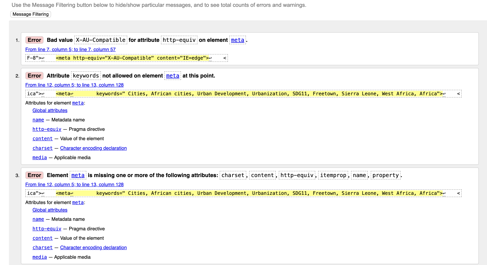

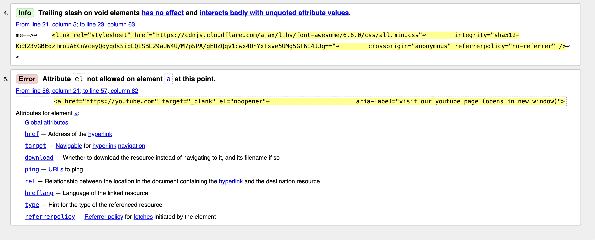

* **ERROR 1:** Bad value for "X-AU-Compatiable" for the `**http-equiv**` attribute on the `<meta>`element (line 7, columns 5-57)
* **SOLUTION:** Corrected a typo from 'AU' to UA in the `**http-equiv**` attribute. 

* **ERROR 2:** Attribute "keyword" not allowed on `<meta>` element (line 12, columns 5-128).
* **ERROE 3:** Missing required attributes (`**charest**`, `**content**`, `**http-equiv**`, `**name**`, `**itemprop**`, `**name**`, `**propoerty**`) on `<meta>`element (line 12 columns 5-128)
* **SOLUTION:** Added miising `**name**` and `**content**`attributes to reolve both errors

* **INFOR:** Trailing slash on void elements interacts badly with unquoted attribute values (line21, columns 5-63).
* **SOULUTION:** Removed trailing slashes from `<link>`elements across all pages.

* **ERROR 4:** Attribute 'el' not allowed on `<a>`element (line 56, columns 21-82).
* **SOLUTIONS:** Corrected the misspelling 'el' to 'rel' in the `<a>`element attribute.

**About Us Page**

* **ERROR:** Same as Error 1 on the Home page.
* **SOLUTION:** Corrected as per Home page solution.

**Get Involved Page**

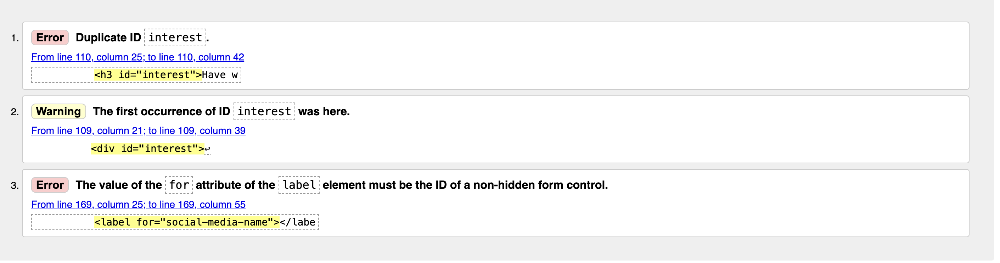

* **ERROR 1:** Duplicated ID 'interest' (line 110, columns 25-42).
* **SOLUTION:** Removed duplicated ID from `<h3>`element. 

* **WARNING:** The first occurrence of ID 'interest' (line 109, columns 21-39).
* **SOLUTION:** Retained the first occurrence and removed the duplicated ID from `<h3>` element.

* **ERROR 2:** The value for the "for" attribute of the `<label>`element must match the ID of the non-hidden form control (line 169, columns 25-55).
* **SOLUTION:** Replaced underscores with hyphens in the input ID to match the `for`attribute.

**Contact US Page:** 
The Contact Us page passed the W3C HTML validation without any errors or warnings, likely due to the corrsctions applied across other pages.

#### CSS Validation

The CSS codes for the Afro Urban Hub website was validated using W3C CSS Validators. Bellow is a summary of the issues identified and the actions taken:

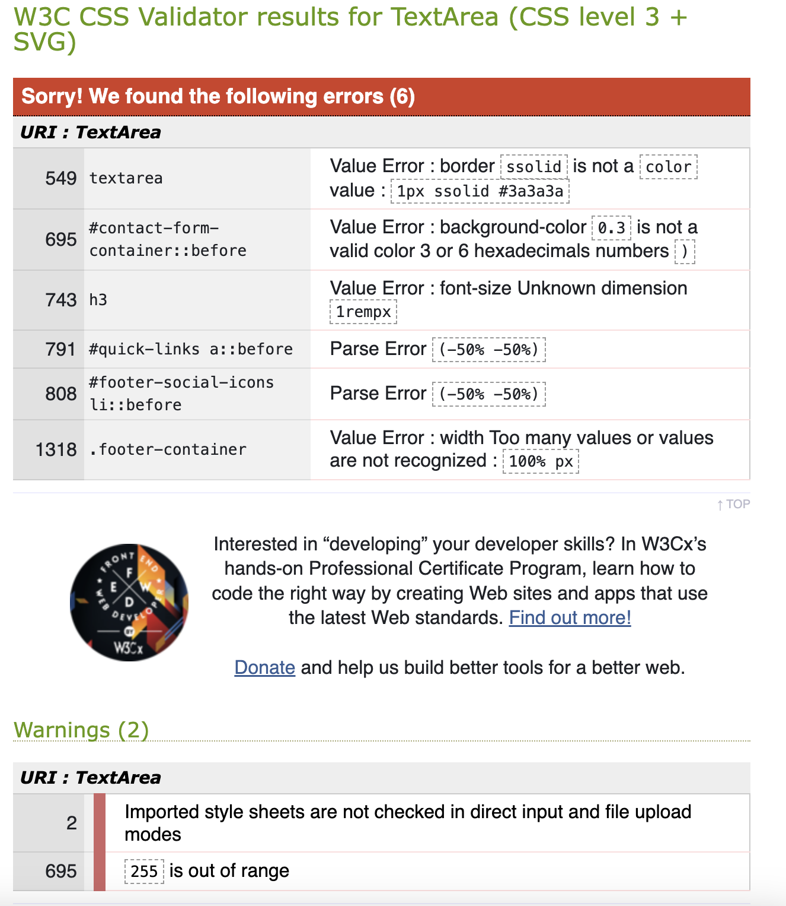

* **ERROR 1:** Line 549, `textarea`Value Error: `border 'ssolid' is not a color; value: '1px ssolid #3a3a3a'`.
* **SOLUTION:** Corrected the typo by changing "ssolid" to "solid"

* **ERROR 2:** lINE 695, `#contact-form-container::before`; Value Error: `background-color '0.3' is not a valid color 3 or 6 hexadecimals numbers`
* **SOLUTION:** Corrected the color value from `rgba(255, 255, 255, 225, 0.3)`to `rgba(255, 255, 255 , 0.3)` and adjusted the alpha value from 255 to 225.

* **ERROR 3:** Line 743, `h3`; Value Error: `font-size unknown dimension '1rempx'`
* **SOLUTION:** Fixed the font-size value to `1rem`instead of `1rempx`.

* **ERROR 4:** Line 791, `#quick-links a::before`; Parse Error: `(-50% -50%)`
* **ERROR 5:** Line 808, `#footer-social-icons li::before`; Parse Error: `(-50% -50%)`
* **SOLUTION:** Removed erroneous code as it was redundant.

* **ERROR 6:** Line 1318, `.footeer-container`; Value Error: `width Too many values or values are not recognized: '100%px'`
* **SOLUTION:** Corrected the width value from `100%px`to `100%`.

* **WARNING 1:** Line 2: Imported style sheets are not checked in direct input and file upload modes.
* **SOLUTION:** This warning is as a result of the limitations to the W3C Validator, which cannot check third-party code. No further action was taken. 

* **WARNING 2:** Line 695: `'255' is out of range`.
* **SOLUTION:** Corrected the out-of-range value from 255 to 225.

All errors and warnings from the W3C Validator were addressed. After applying the necessasry corrections, the HTML and CSS codes were revalidated and no further errors were found.

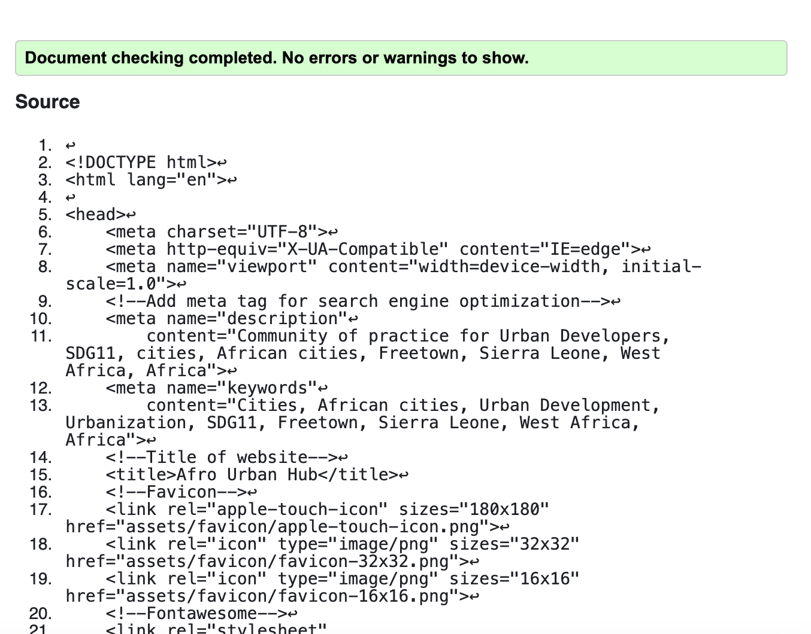
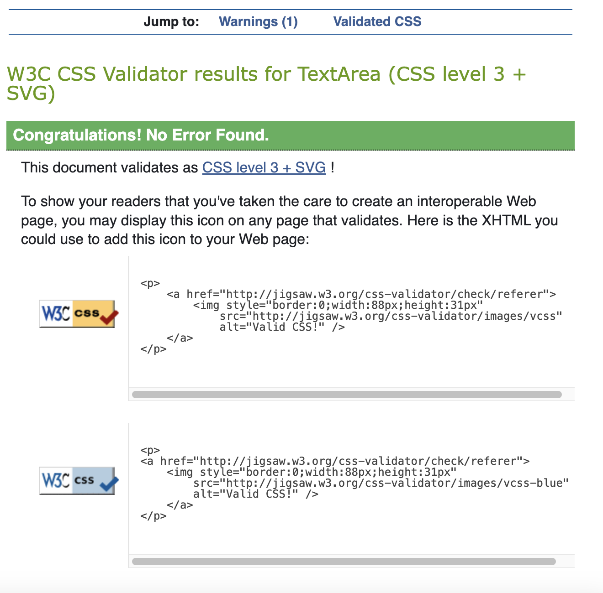

### Lighthouse Testing

After conducting a Lighthouse test via Chrome DevTools to assess Performance, Accessibility, Best Practice and SEO, several issues were identified across al pages. These issues primarilly affected Performance, Accessibility and Browser functionality, impacting overall site performance 

#### Accessibility

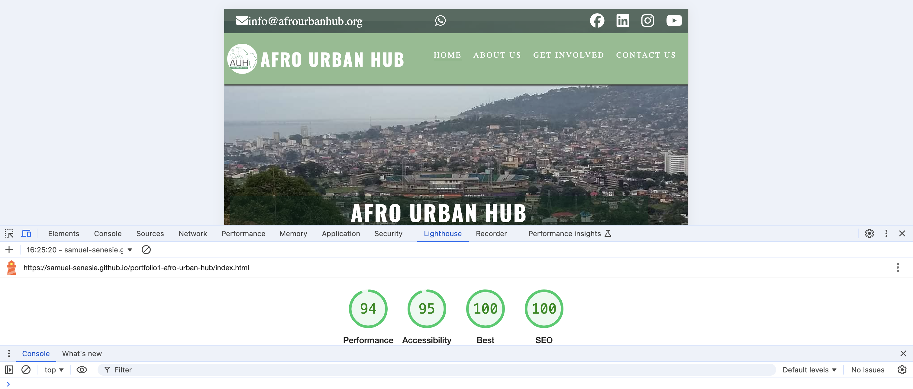

* **Error:** Touch targets, such as icons, didi not have sufficient size and spacing.
* **Solution:** Resolved by removing the TikTok icon and Whatsapp number, and increasing the font size and spacing in the top bar to create space for the touchable elements.

* **Error:** Some links did not have discernible names for screen readers.
* **Solution:** Added `aria-label`attributes to the back-to-top and Whatsapp icons to provide clear labels.

#### Browser Error
* **Error:** Uncaught SyntaxError: "missing `)`, after argument list" at index.html240:13
* **Solution:** Corrected by replacing the colon with a comma at line 240,  column 13. This fix was applied to all relevant pages.

* **Error:** Insufficient contrast ratio between background and foreground colors.
* **Solution:** Improved contrast by changng the background color from `#fff`to `rgb(225, 225, 225)`

* **Error:** Failed to load resources with a 404 status; syntax error in `site.webmanifest`.
* **Action:** This issue remains unresloved due to its complexity.

#### Performance
* **Problem:** Images were not properly sized, affecting performance.
* **Solution:** The problem was addressed by removing, resizing and compressing icons, logo, and images using TinyPNG and ILoveIMG. While performance improved, the issue was not completely reloved. 

### Manual Testing
The website was testd manually to know if all the links and functions work properly.

#### Navigation Bar
**Top Bar**
* Verified that clicking the email link opens a mailto window in a new tab, with no broken link.

* Confirmed that clicking the WhatsApp icon opens the WhatsApp web page in a new tab, and on smartphones, it redirects to the WhatsApp app.

* Verified that clicking the Facebook icon takes users to the Afro Urban Hub Facebook page, and all other social media icons open their respective default homepages. All icons and links in the top bar have the correct alt text and aria-labels.

**Main Nab Bar**
* All links navigate to the correct pages and open in a new tab, with no broken links.

* Confirmed that clicking the logo returns users to the homepage, which is the default landing page, and that the logo has the correct alt text.

* Verified that the active page is highlighted with an underline beneath the menu item.
Ensured the navigation bar is fully responsive across all devices.

* Checked that the hover effect and pointer are consistent for all items

#### Home Page
* Confirmed that all images and illustrations have the correct alt texts and aria-labels.

* Verified that all elements are fully responsive.

#### Get Involved Page

* Confirmed that all images have the correct alt texts and aria-labels.

* Verified that the form cannot be submitted if mandatory fields are not filled and Terms are not accepted.

* Ensured that when users complete all mandatory fields and click the “Get Involved” button, the information is sent to https://formdump.codeinstitute.net.

* Verified that all elements are fully responsive.

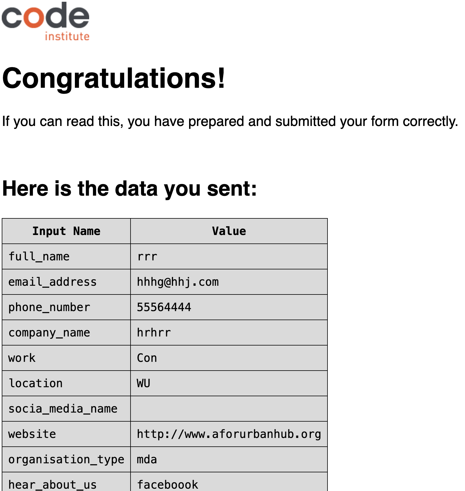

#### Contact Page
* Confirmed that all images have the correct alt texts and aria-labels.

* Verified that the form cannot be submitted if mandatory fields are not filled and Terms are not accepted.

* Ensured that when users complete all mandatory fields and click the “SEND” button, the information is sent to https://formdump.codeinstitute.net.
Verified that all elements are fully responsive.

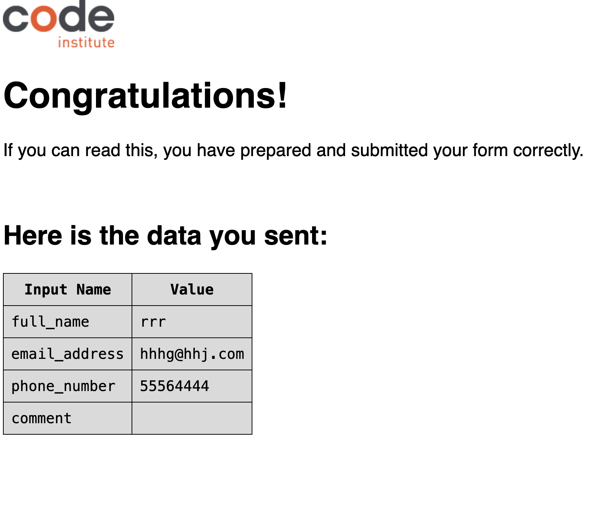

#### Back-to-Top Button

* Confirmed that clicking the back-to-top button scrolls users back to the top of the page automatically. Verified that the icon has the correct aria-label.

#### Footer
* Verified that all links under the Quick Links section open correctly in a new tab.

* Confirmed that on hover, the white social media icons change color to aqua.

* Ensured that clicking the Facebook icon takes users to the Afro Urban Hub Facebook page, and all other social media icons open their default homepages. All icons and links in the footer have the correct alt text and aria-labels.

## Technologies Used
* **[GitPod Enterprise](https://www.gitpod.io/enterprise):** Used for writing HTML and CSS codes. HTML5 was used to strcture the content of the website, while CSS3 provided styling to enhance the user experience. 

* **GitHub:** Used for hosting and deploying the website.

* **GitBash:** Used to push new code to GitHub repository.

* **WSC Validators:** [HTML](https://validator.w3.org) and [CSS](https://jigsaw.w3.org) validators were used for code validation

* **Chrome DevTools:** Used for performing Lighthouse testing.

* **[Balsamiq](https://balsamiq.com):** Used to create the wireframes for the website.

* [TinyPNG](https://tinypng.com) and [ILoveIMG](https://www.iloveimg.com/) tools were used for resizing and compressing images.

* [Cooler.co](https://coolors.co/) was used to generate the colour palette.

* **ChatGPT:** Assisted with editing the text contents for the website and this README document.

## Credits

* **Fonts:** Sourced and imported from [Google Fonts](https://fonts.google.com/)

* **Icons:** Sourced from [Font Awsome](https://fontawesome.com/).

* **images and Illustration:** creits to [Pixapay](https://pixabay.com/) and [Unsplash](https://unsplash.com).

* **Logo:** Created by Afro Urban Hub

* **Cover Image on Home Page:** Provided by the author of this work.

* **Image Optimization:** Performed using [TinyPNG](https://tinypng.com) and [ILoveIMG](https://www.iloveimg.com/)

* **Footer Design:** Inspired by [Taru Code](https://www.youtube.com/watch?v=dlsjiphBris)

* **Back-to-Top Button** Adapted from [Drake Code](https://www.youtube.com/watch?v=Vef9bxTilCU)

* **Double Navbar:** Implemented following the tutorial by [Code Tonight](https://www.youtube.com/watch?v=F3pSGnhV-H8)

* **JavaScript Code for Font Awesome Kit:** Imported from [Font Awsome](https://fontawesome.com/).

* **JavaScript Code for Clear Form After Submission:** Developed with assitance from ChatGPT.

* **Wedsite Inspiration and Design:** Drawn from the Love Running Walkthrough Project for the Code Institute's Full Stak Software Development Diploma Course.

## Acknowledgements
I would like to express my gratitude to my mentor, Akshat Gar, and ma cohort facilitator, Kay Welfare, for their invaluable guidiance and support. I also appreciate the honest feedback and direction provided by my classemate. 

